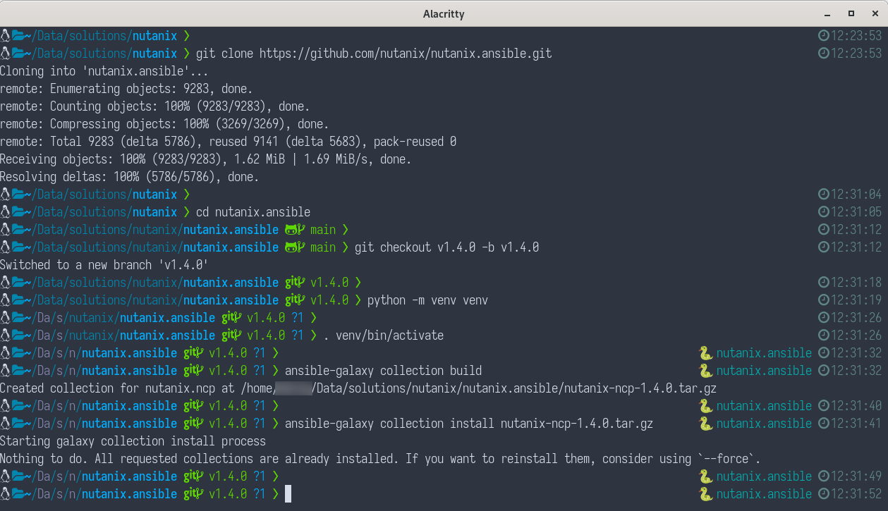
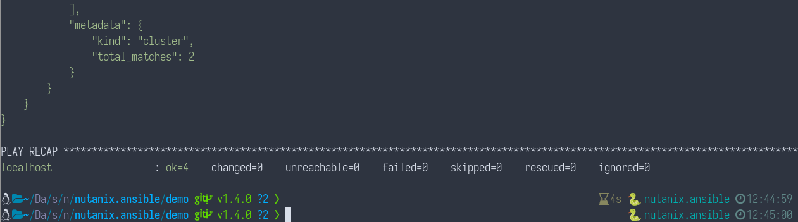
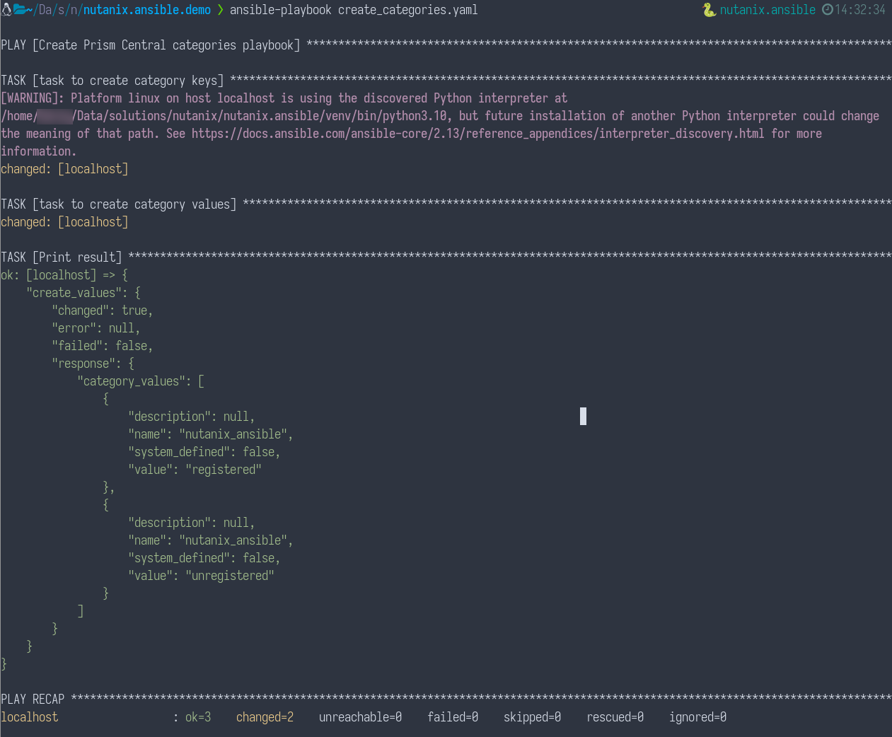
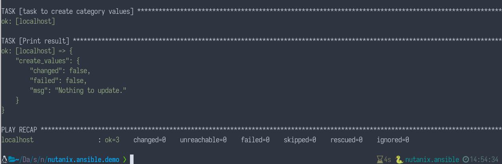

# Nutanix Ansible Demo

The steps below show how to begin testing and using the [Nutanix _nutanix.ncp_ collection for Ansible](https://github.com/nutanix/nutanix.ansible).

## Summary

The steps here are intended for use by those new to using sensitive information with Ansible Vault and how to use that sensitive information to connect to a Nutanix Prism Central instance.

## Requirements

- A Nutanix Prism Central or Prism Element instance.  The steps here have been tested with Prism Central version _pc.2022.1_ and Nutanix AOS version 6.0.
- A local install of Ansible.  It is strongly recommended to follow the [official Ansible documentation](https://docs.ansible.com/ansible/latest/installation_guide/index.html) during installation.
- Nutanix Ansible compatibility requirements will always be maintained in the official [Nutanix Ansible repo](https://github.com/nutanix/nutanix.ansible).
- _git_, for Nutanix Ansible source download.
- Basic terminal usage knowledge is assumed.

These steps are have been written and tested in a Linux environment but should be very similar on Mac OS X.  Some changes will be required for use in Windows environments.

## Nutanix Ansible Installation

Note: The steps below have been tested with the versions mentioned above. For the latest details we recommend consulting the [official Nutanix Ansible repository](https://github.com/nutanix/nutanix.ansible) documentation.

- Install and build:

  Note: At the time of writing this README, the Nutanix Ansible current version is _v1.4.0_.

  ```
  # download the Nutanix Ansible source
  git clone https://github.com/nutanix/nutanix.ansible.git
  cd nutanix.ansible
  git checkout v1.4.0 -b v1.4.0
  # optional, but recommended: create and activate a python virtual environment
  python -m venv venv
  . venv/bin/activate
  # build and install the collection
  ansible-galaxy collection build
  ansible-galaxy collection install nutanix-ncp-1.4.0.tar.gz
  ```

  Note: Use the recommended _--force_ option if you need to repeat the install e.g. if you have installed the Nutanix Ansible package in the past.

  The screenshot below shows an example of the above steps when carried out in a Linux environment.

  

## Demo Configuration

Note: These steps will continue with demo configuration within the cloned repository's directory.  You may wish to complete these steps in a dedicated directory.

- Create a subdirectory for the demo files.

  ```
  mkdir demo
  cd demo
  ```

- Create Ansible Vault password file:

  ```
  # don't forget to change the command below so that your preferred password is used
  echo 'your_password_here' > .vault_pass
  ```

- Make sure the _.vault_pass_ file is never added to source control:

  ```
  echo .vault_pass > .gitignore
  ```

- Create Ansible hosts file:

  - Create a new file named _hosts_
  - Set the _hosts_ file contents as follows:

    ```
    [dev]
    localhost ansible_connection=local
    ```

    Note: This example uses a hosts group named _dev_ but you may name the group anything you like.

- Create this project's Ansible configuration file:

  - Create a new file named _ansible.cfg_
  - Set the _ansible.cfg_ file contents as follows:

    ```
    [defaults]
    inventory = ./hosts
    vault_password_file = ./.vault_pass
    ```

- Create the variable directory structure:

  ```
  mkdir -p group_vars/dev
  ```

- Create public variables file:

  - Create a new file named _group_vars/dev/vars_

    ```
    touch ./group_vars/dev/vars
    ```
  
  - Set the _group_vars/dev/vars_ file contents as follows:

    ```
    ---
    # public data
    pc_ip: your_prism_central_ip_address_here
    ```

- Create the sensitive data variables file:

  ```
  ansible-vault create group_vars/dev/vault
  ```

  - Set the contents of the _group_vars/dev/fault_ file as follows:

    ```
    ---
    # sensitive data
    vault_pc_username: your_prism_central_username_here
    vault_pc_password: your_prism_central_password_here
    ```

    Note: If you view the contents of the _vault_ file now, you'll see the encrypted contents only.  To edit the contents of the vault later, use the following command:

    ```
    ansible-vault edit ./group_vars/dev/vault
    ```

 - Create the Ansible playbook that will read the list of clusters:

   - Create a new file named _clusters_info.yaml_
   - Note this file is based on _examples/clusters_info.yml_ found in the Nutanix Ansible repo
   - Set the contents of the _clusters_info.yaml_ file as follows:

     ```
     ---
     - name: Clusters_Info playbook
       hosts: localhost
       gather_facts: false
       collections:
         - nutanix.ncp
       module_defaults:
         group/nutanix.ncp.ntnx:
           nutanix_host: "{{ pc_ip }}"
           nutanix_username: "{{ vault_pc_username }}"
           nutanix_password: "{{ vault_pc_password }}"
           validate_certs: false

     tasks:
     - name: test getting all clusters
       ntnx_clusters_info:
       register: clusters

     - name: test getting particular cluster using uuid
       ntnx_clusters_info:
       cluster_uuid: '{{ clusters.response.entities[0].metadata.uuid }}'
       register: result

     - name: List clusters using length, offset, sort order and priority sort attribute
       ntnx_clusters_info:
         length: 2
         offset: 0
         sort_order: "ASCENDING"
         sort_attribute: "name"
       register: result

     # additional task
     - name: Print cluster list
       ansible.builtin.debug:
         var: result
       when: result is defined
     ```

     Note: Jinja2 templating is used to define which variables from our vault are used throughout the playbook.

## Test Playbook

- First test, getting cluster info:

  ```
  ansible-playbook clusters_info.yaml
  ```

  If the connection to Prism Central was successful, the output of the clusters list module will be displayed.  This output can be extensive but will end with something similar to the screenshot shown below:

  

  Note: For this demo, Ansible may warn about the Python interpreter being used.  This warning can be safely ignored during this demo.

- Second test, creating Prism Central categories:

  ```
  ansible-playbook create_categories.yaml
  ```

  If the connection to Prism Central was successful, the output of creating Prism Central categories will be displayed.  The indicator of success during this test, assuming a matching category doesn't already exist, is the indication that 2 changes were made.  See the screenshot below for an example.

  

  The configuration management nature of Ansible now means running the playbook again will result in no changes being made.

  

## Resources

- [Official Nutanix Ansible repository](https://github.com/nutanix/nutanix.ansible)
- [Nutanix Developer Portal](https://www.nutanix.dev)
- [Nutanix](https://www.nutanix.com)
